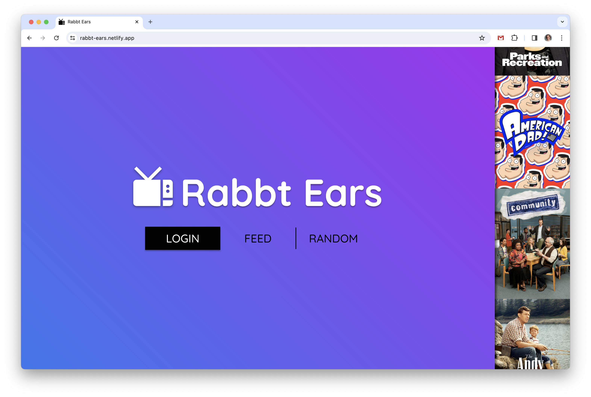
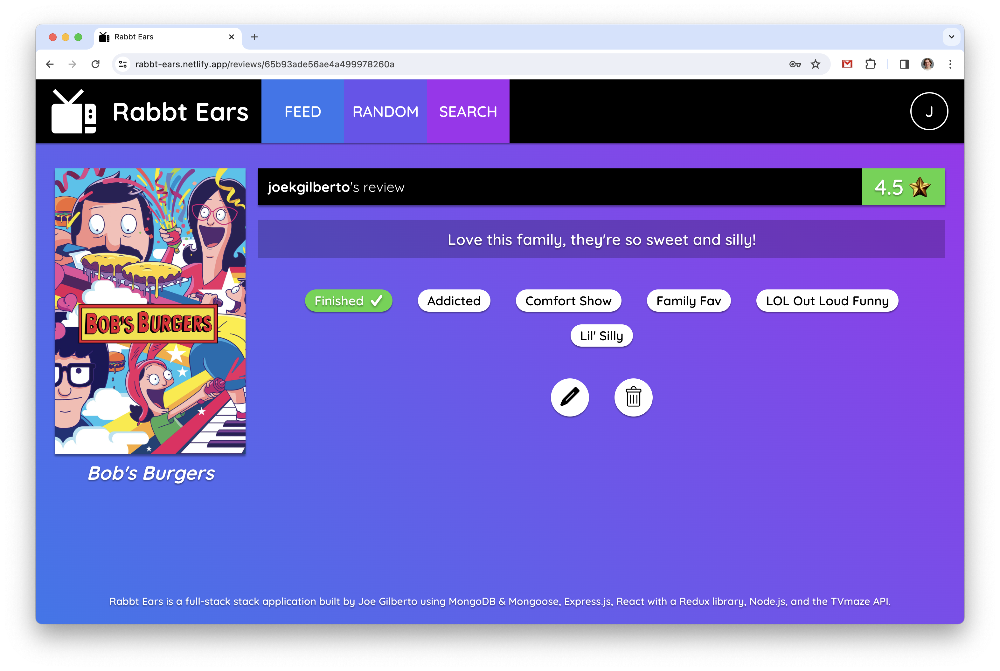
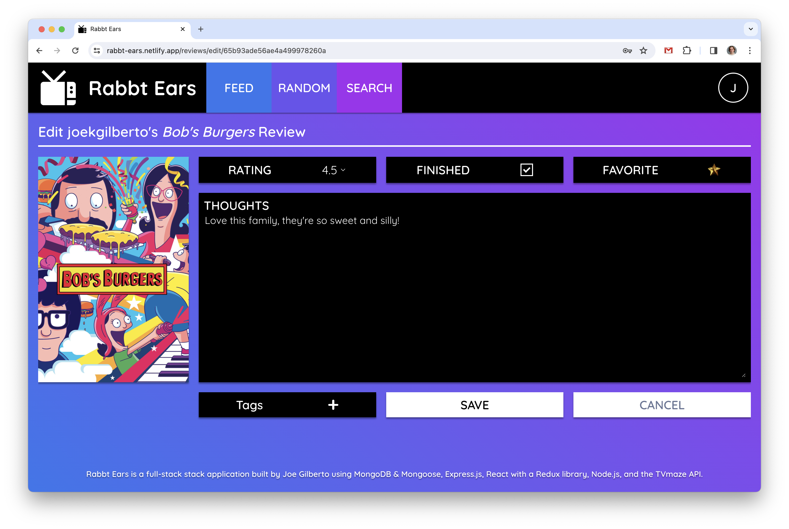
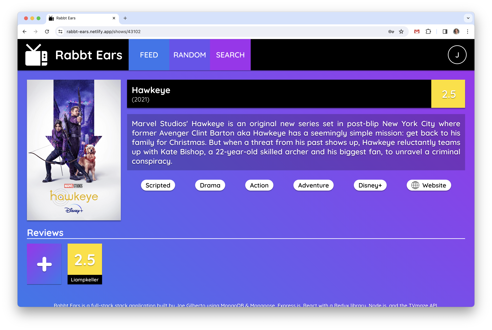
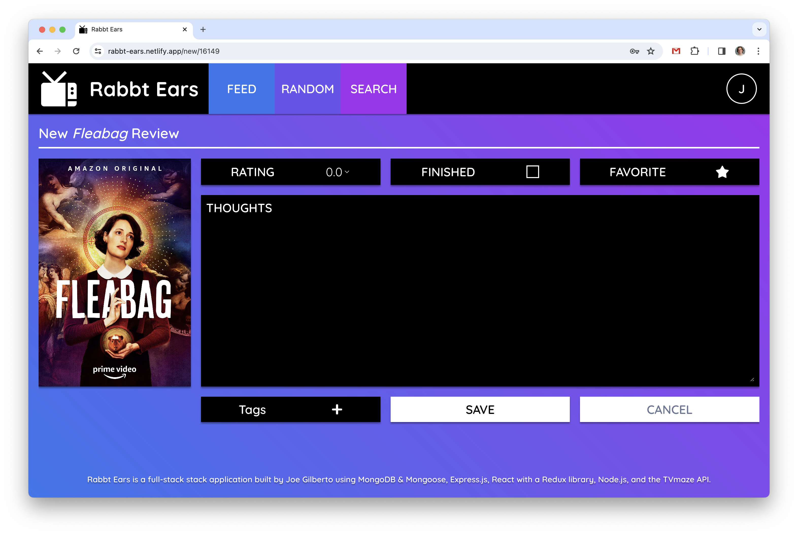
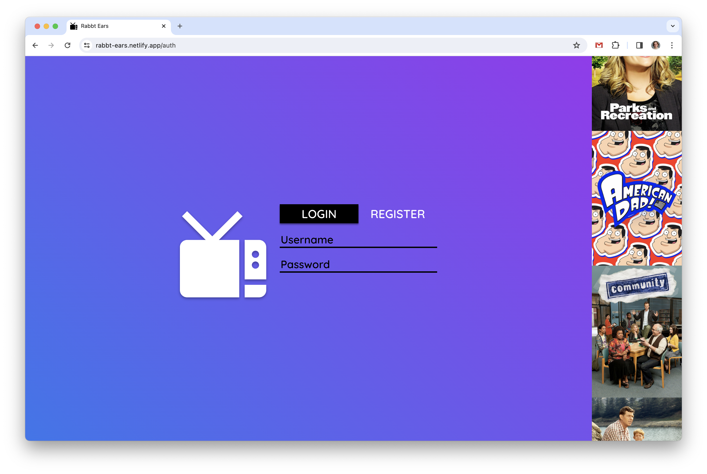

# Rabbt Ears
A full-stack MERN application that allows users to read up on their favorite tv shows and review them!  Utilizes a React frontend with a Redux library, making Axios API calls to the TVMaze API and deployed on Netlify, and an Express.js and Node.js backend deployed on Heroku interacting with a MongoDB database structured by Mongoose schemas.  Built by [Joe Gilberto](https://joekgilberto.com/).

## Deployment
Find the app deployed on Netlify, here: [https://rabbt-ears.netlify.app/](https://rabbt-ears.netlify.app/)

[](https://app.netlify.com/sites/rabbt-ears/deploys)

## Screenshots
### Home

As a user, I want to land on an informational home page when I visit the application.

### Feed

As a user, I want to be able to see all recent reviews and get suggested new shows to review. 

### Show Review

As a user, I want to be able to read a review when I navigate to its details page.  If I'm the owner, I want to be able to edit or delete a review.

### Edit Review

As a user, I want to be able to edit a review if I'm the owner.

### Show Review

As a user, I want to be able to read more about a show when I navigate to its details page, all its reviews, its average score, and the option to review it.

### New Review

As a user, I want to be able to review a show.

### Auth

As a user, I want to be able to login or register for more utlities and personalized data.

### Profile

As a user, I want to be able to view a profile, mine or others, and see that user's favorite shows and reviews.


## Technologies Used

Rabbt Ears is a MERN stack application.  In employs a [React](https://react.dev/) frontend with a [Redux](https://redux.js.org/) library deployed on [Netlify](https://www.netlify.com/) that interacts with a [third-party TVMaze API](https://www.tvmaze.com/api/) and a [Node.js](https://nodejs.org/en) backend with a [Express.js](https://expressjs.com/) framework deployed on [Heroku](https://www.heroku.com/).  The backend interacts with a [MongoDB](https://www.mongodb.com/) database structured by [Mongoose](https://mongoosejs.com/) schemas.

## Attributions and Acknowledgements
Below are specific relevant resources I referenced while building this application.

- [The TVMaze API](https://www.tvmaze.com/api/) I used to gather television show information.
- [A public domain pencil icon](https://commons.wikimedia.org/wiki/File:Pencil_-_The_Noun_Project.svg) I used as an edit icon.
- [A public domain trash icon](https://commons.wikimedia.org/wiki/File:Trash_(89060)_-_The_Noun_Project.svg) I used as a delete icon.
- [A public domain bookmark icon](https://commons.wikimedia.org/wiki/File:Bookmark-fav-front-color.png) I used as a favorite icon.
- [A public domain website icon](https://commons.wikimedia.org/wiki/File:Noun_Project_website_icon_3077870.svg) I used as a website icon.
- [A public domain checkmark icon](https://commons.wikimedia.org/wiki/File:Check_Mark_(89605)_-_The_Noun_Project.svg) I used as a finished icon.


## Instructions for Local Deployment
The following instructions were used through macOS with a silicone M1 chip.

### Fork and clone
To deploy locally, fork and clone this repo.  Then, using the terminal, navigate into the backend directory.

### Install backend dependencies
Install backend dependencies by running:
```
npm i
```

### Create a database
Then, create a [MongoDB database](https://www.mongodb.com/) and retrieve your connection string through the drivers option.

### Create backend environmental variables
Still in the backend directory, create an env file:
```
touch .env
```
Within that .env file, add that connection string to a DATABASE_URI vairable, a PORT variable with a port number for your backend to run on and for your frontend to connect to, and a JWT_SECRET vairable of your choosing:
```
DATABASE_URI='<connection string>
PORT=<a number, typically 4000>
JWT_SECRET='<your secret>'
```

### Spin up backend server
For the final step of your backend set up, spin up the server with the following command:
```
 nodemon
```

### Install frontend dependencies
For the first step of your frontend set up, navigate into your frontend directory via your terminal and install your dependencies.
```
npm i
```

### Create frontend environmental variables
Next, create your environmental variables:
```
touch .env.local
```
Then, add your database environmental variables to interact with your backend (running on localhost at the PORT defined in your backend .env):
```
REACT_APP_REVIEWS_API_URL=<PORT>/reviews/
REACT_APP_AUTH_API_URL=<PORT>/auth/
REACT_APP_TVMAZE_API_URL=https://api.tvmaze.com/shows/
REACT_APP_TVMAZE_SEARCH_URL=https://api.tvmaze.com/search/shows?q=
```

### Spin up your frontend server
Finally, while still in your frontend directory, spin up your front server:
```
npm start
```

### Browse
Now, you can go to localhost:3000 in your browser (Google Chrome is reccommended for best performance) and browse the application.


## Current User Flow
Explore the app here: [https://rabbt-ears.netlify.app/](https://rabbt-ears.netlify.app/)

Land on our colorful homepage and login or dive right into our feed.  From there, you can click on exisiting reviews or look into some suggested shows.  Use the searchbar at the top to browse a wide range of television shows.  Login (or sign up) to start sharing your own opinions!  You even have a personal user pages to view your favorite shows, recent reviews, and Rabbt Ears reviewer status!

## Future Features
Features to be added in further edits:
- Adding comments for reviews
- Adding a want to watch list for users
